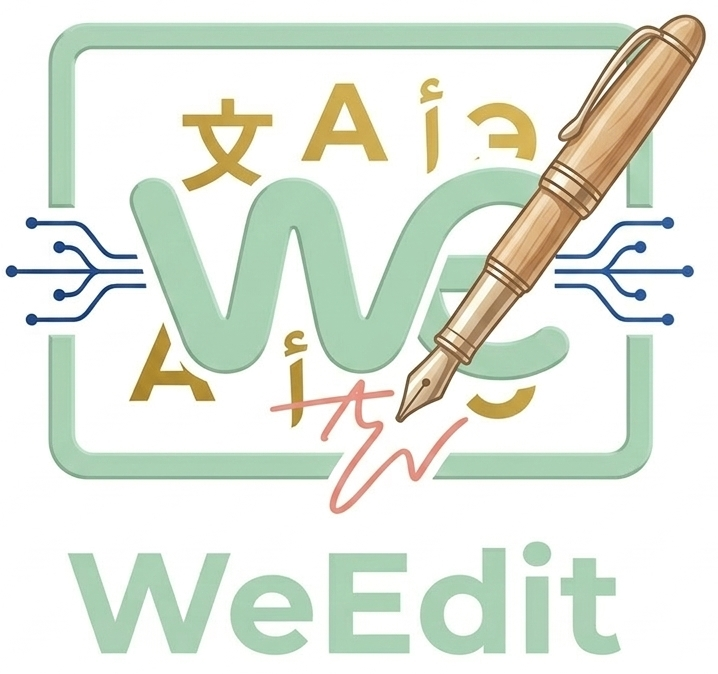
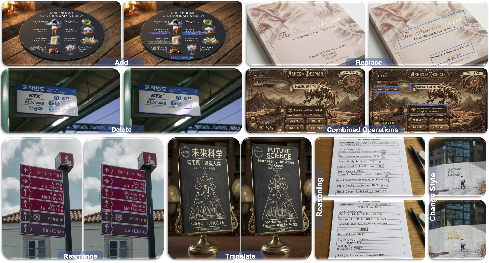
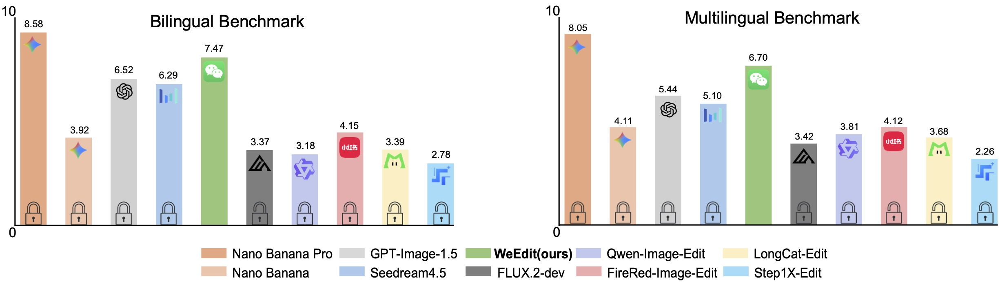
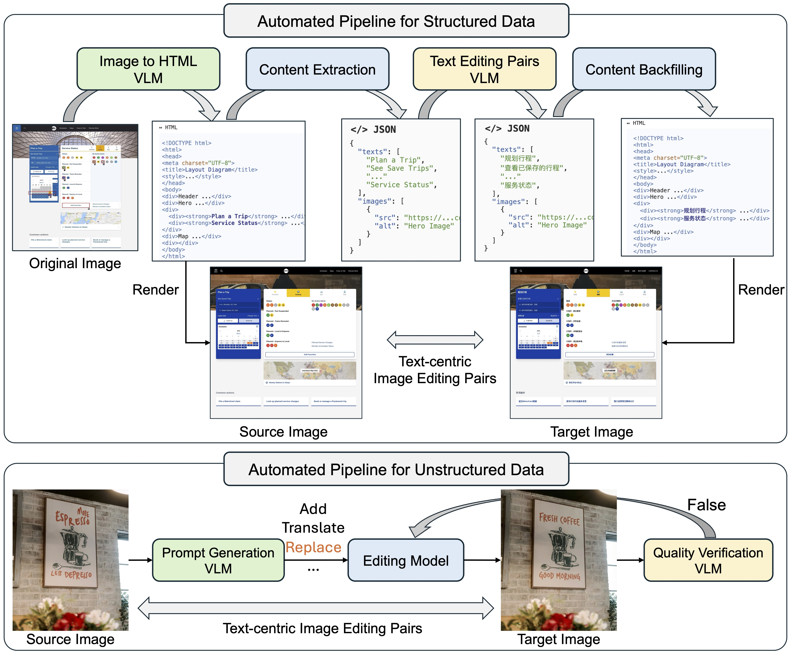
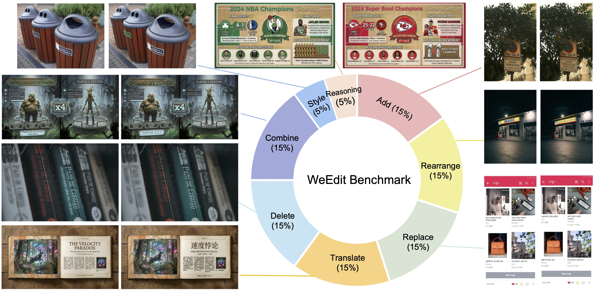
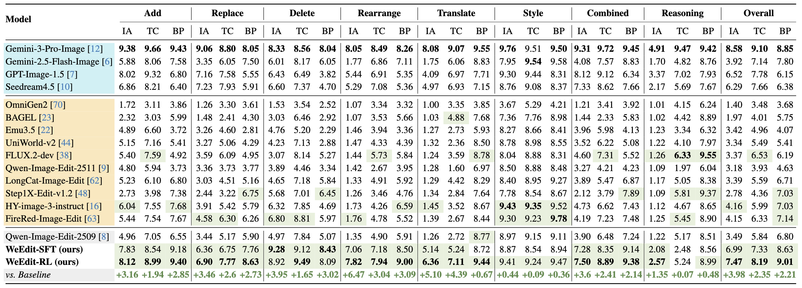
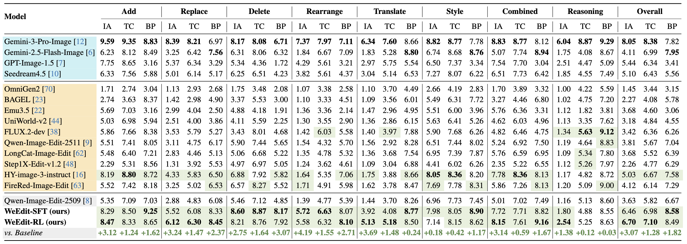

#  WeEdit




<br>
<a href="https://arxiv.org/pdf/2603.11593"></a>
<a href="https://huizhang0812.github.io/WeEdit/"></a>
<a href="https://huggingface.co/datasets/HuiZhang0812/WeEdit_benchmark"></a>

>  **WeEdit: A Dataset, Benchmark and Glyph-Guided Framework for Text-centric Image Editing**
> <br>
> [Hui Zhang](https://huizhang0812.github.io/)<sup>1,2</sup>,
> [Juntao Liu](https://scholar.google.com/citations?user=WuXHtcgAAAAJ&hl=zh-CN)<sup>1</sup>,
> [Zongkai Liu](https://dblp.org/pid/214/0917.html)<sup>1,3</sup>,
> [Liqiang Niu](https://scholar.google.com/citations?user=9Qk5MEAAAAAJ&hl=zh-CN)<sup>1</sup>,
> [Fandong Meng](https://fandongmeng.github.io/)<sup>1</sup>,
> [Zuxuan Wu](https://zxwu.azurewebsites.net/)<sup>2</sup>,
> and
> [Yu-Gang Jiang](https://scholar.google.com/citations?user=f3_FP8AAAAAJ)<sup>2</sup>
> <br>
> <sup>1</sup>WeChat AI, Tencent, <sup>2</sup>Fudan University, <sup>3</sup>Sun Yat-sen University
> <br>

## Introduction

WeEdit is a systematic framework for text-centric image editing, addressing the challenges of modifying, translating, and rearranging textual elements embedded within images.

**WeEdit Dataset** 🗂️: A large-scale dataset of 330K text-centric editing pairs constructed via a novel HTML-based automatic pipeline, covering 7 editing operations and 15 languages.

**WeEdit Benchmark** 📊: Standardized bilingual (Chinese-English) and multilingual (15 languages) benchmarks with 2,000 test cases each, covering 8 editing operations (Add, Replace, Delete, Rearrange, Translate, Change Style, Combined, and Reasoning) for comprehensive evaluation.

**Glyph-Guided SFT** ✏️: A supervised fine-tuning stage that injects rendered glyph images as explicit spatial priors, enabling precise text placement and character-level fidelity.

**Multi-Objective RL** 🎯: A reinforcement learning stage with separate reward models targeting instruction adherence, text clarity, background preservation, and relative quality.


## Dataset and Benchmark

### WeEdit Dataset


Our WeEdit dataset contains **330K high-quality text-centric image editing pairs** constructed through two complementary pipelines:

- **Structured Data (~170K)**: A novel HTML-based pipeline converts source images to HTML, extracts and edits text content via a VLM, and renders both source and target images through a headless browser, yielding pixel-perfect editing pairs.
- **Unstructured Data (~160K)**: An automated edit-verify-and-retry pipeline operates directly at the image level for images with complex layouts, diverse typography, and text tightly entangled with complex visual backgrounds.

The dataset covers **7 editing operation types** (Add, Replace, Delete, Rearrange, Translate, Change Style, Combined) and **15 languages** (English, Chinese, Hindi, Spanish, French, Arabic, Portuguese, Bengali, Russian, German, Korean, Japanese, Thai, Indonesian, Vietnamese).

### WeEdit Benchmark <a href="https://huggingface.co/datasets/HuiZhang0812/WeEdit_benchmark"></a>

Our comprehensive benchmark evaluates text-centric image editing capabilities across multiple dimensions:

- **Bilingual Benchmark**: 2,000 test cases covering Chinese and English
- **Multilingual Benchmark**: 2,000 test cases spanning 15 languages
- **8 Task Categories**: Add, Replace, Delete, Rearrange, Translate, Change Style, Combined, and Reasoning
- **3 Evaluation Dimensions**: Instruction Adherence (IA), Text Clarity (TC), and Background Preservation (BP)



### Evaluation

To evaluate a model's text-centric image editing capabilities on our benchmark:

1. Generate edited images and save them to a results directory with a `generated_imgs/` subfolder. Each image should be named as `{img_id}_{instruction_type}.png`, where `img_id` and `instruction_type` are from the corresponding benchmark item.

2. Implement your own Gemini-3-Pro API call in `evaluation/evaluation_benchmark.py` by filling in the `call_gemini()` function.

3. Run the evaluation script:

Evaluate on the **Bilingual Benchmark**:
```bash
python evaluation/evaluation_benchmark.py \
    --results_dir <path_to_results> \
    --benchmark_file benchmark/Bilingual_benchmark.jsonl
```

Evaluate on the **Multilingual Benchmark**:
```bash
python evaluation/evaluation_benchmark.py \
    --results_dir <path_to_results> \
    --benchmark_file benchmark/Multilingual_benchmark.jsonl
```

The evaluation uses Gemini-3-Pro as an impartial VLM judge to score edited images across Instruction Adherence, Text Clarity, and Background Preservation on a 0-9 scale.


## Main Results

### Bilingual Benchmark



### Multilingual Benchmark




WeEdit achieves the **best performance among open-source models** on both benchmarks, surpassing most proprietary models and ranking second only to Gemini-3-Pro-Image.

## Citation

If you find our work useful for your research and applications, please kindly cite using this BibTeX:

```latex
@article{zhang2026weedit,
  title={WeEdit: A Dataset, Benchmark and Glyph-Guided Framework for Text-centric Image Editing},
  author={Zhang, Hui and Liu, Juntao and Liu, Zongkai and Niu, Liqiang and Meng, Fandong and Wu, Zuxuan and Jiang, Yu-Gang},
  journal={arXiv preprint arXiv:2603.11593},
  year={2026}
}
```
